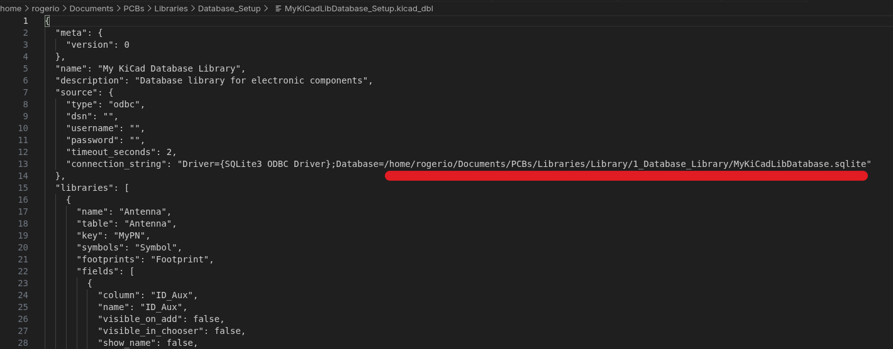
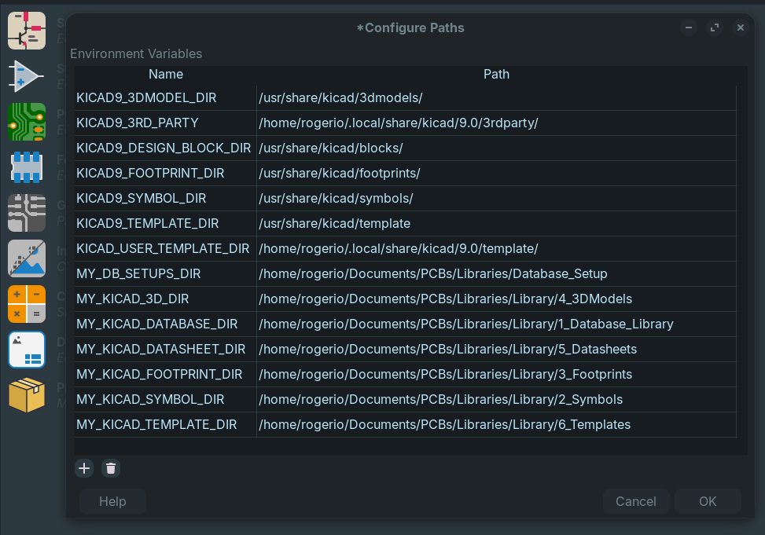
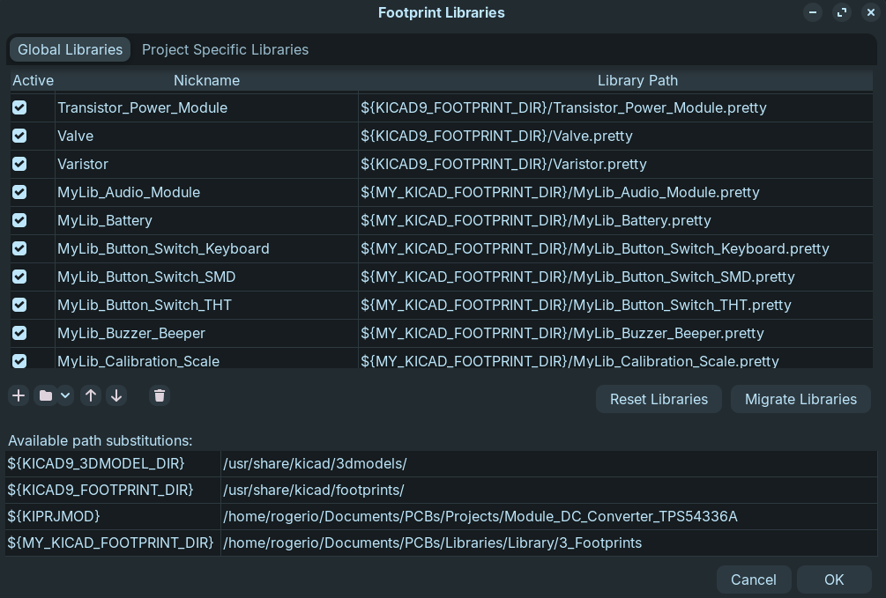
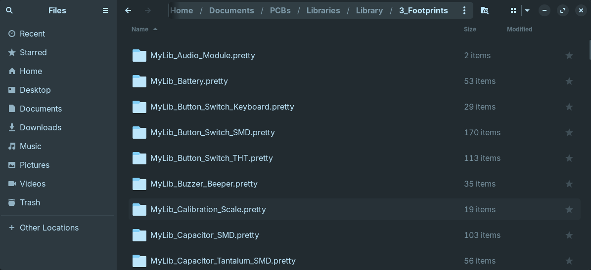
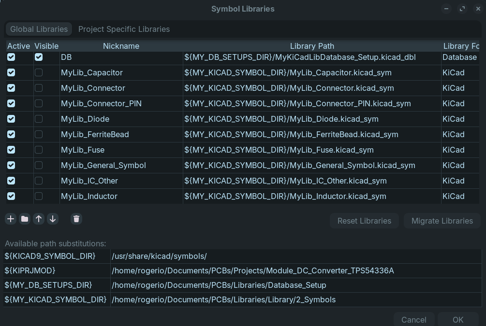
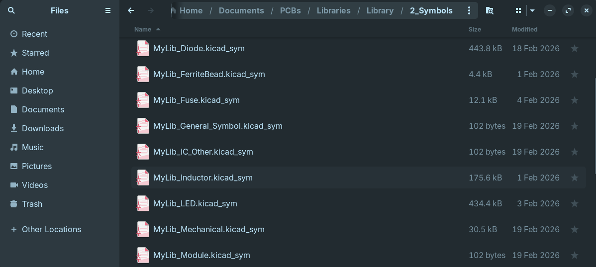
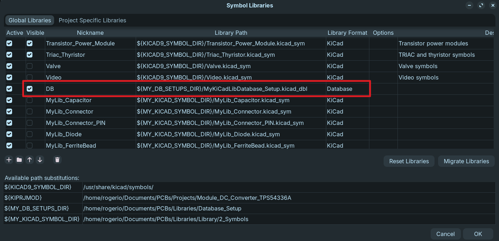
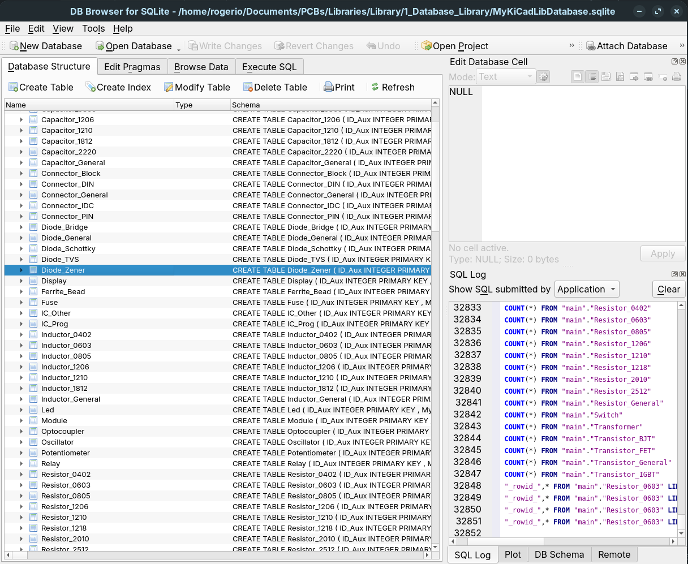

# KiCAD_DBLibrary_Example

This repository provides an example of a **KiCad Database Library** setup. It includes the necessary files and folder structure to help you integrate a SQLite database as a symbol library in KiCad, allowing for centralized component management.

## 📦 Contents

- `Database_Setup/` – Contains the `.kicad_dbl` configuration file and the SQLite database.
- `Library/` – Holds the footprint and symbol libraries (copies/modified versions of KiCad libraries).
- `PyGen/` – Python script to regenerate the `.kicad_dbl` file if you add new tables to the database.
- `Imagens/` – Screenshots to guide you through the installation process (images named `image1.png` to `image9.png`).

> **Note:** If your images have different filenames (e.g., with spaces), please rename them to `image1.png` … `image9.png` for the links below to work correctly.

## 🚀 Installation Guide

Follow these steps to install and configure the database library in KiCad.

### Prerequisites

- KiCad (version 6 or later recommended - Not the Flatpak)
- A SQLite browser (e.g., [DB Browser for SQLite](https://sqlitebrowser.org/)) if you plan to edit the database manually.
- Basic familiarity with KiCad’s library management.

---

### Step 1: Update the Database Configuration File

1. Navigate to the `Database_Setup` folder.
2. Open the file `Database_Setup.kicad_dbl` in a text editor.
3. Locate the path to the SQLite database file (`Database.sqlite`) and update it to match the **absolute path** on your system.  
   Example: `"path": "C:/Users/YourName/.../Database_Setup/Database.sqlite"`
4. Save the file.

---

### Step 2: Configure Paths in KiCad

1. Launch KiCad.
2. Go to **Preferences → Configure Paths**.
3. Add new path variables for the directories where your libraries are stored.  
   For example, if your repository is located at `D:/KiCAD_Projects/OS-001-KiCAD_DBLibrary_Example`, you might add:
   - `LIBRARY_DIR` = `D:/KiCAD_Projects/OS-001-KiCAD_DBLibrary_Example/Library`
   - `FOOTPRINTS_DIR` = `D:/KiCAD_Projects/OS-001-KiCAD_DBLibrary_Example/Library/3_Footprints`
   - `SYMBOLS_DIR` = `D:/KiCAD_Projects/OS-001-KiCAD_DBLibrary_Example/Library/2_Symbols`
   *(Adjust names and paths as needed.)*
4. Click **OK** to save.

---

### Step 3: Add Footprint Libraries

1. In KiCad, go to **Preferences → Manage Footprint Libraries**.
2. Click the folder icon to add a new library.
3. Browse to the `Library/3_Footprints` folder.
4. Select the footprint library files (they typically start with `MyLib_` and they are copies of the KiCads libraries).
5. Add all the libraries with "Add Existing" button .
6. Click **OK** to close the dialog.

---

### Step 4: Add Symbol Libraries (Static)

1. Go to **Preferences → Manage Symbol Libraries**.
2. Click the folder icon and browse to `Library/2_Symbols`.
3. Select the symbol library files (they also start with `MyLib_` and they are not copies of the KiCad libraries). These will contain your custom symbols.
4. **Important:** For each of these libraries, **uncheck** the **Visible** option. This prevents them from appearing in the symbol chooser; they are only used as a fallback or for legacy compatibility.
5. Click **OK** to save.

---

### Step 5: Add the Database Library

1. In **Manage Symbol Libraries** (still open), click **Add**.
2. Change the library format to **Database**.
3. Click the folder icon and select the `Database_Setup.kicad_dbl` file you modified in Step 1.
4. Give the library a name (e.g., `DB`).
5. Ensure the **Visible** option is **checked** (so it appears in the symbol chooser).
6. Click **OK**.

---

### Step 6: Editing the Database (Adding Components)

- Use your preferred SQLite browser (e.g., DB Browser for SQLite) to open the `Database.sqlite` file located in the `1_Database_Library` folder.
- You can add, edit, or remove components directly in the database tables.
- If you **create a new table**, you must update the `.kicad_dbl` file so KiCad recognizes it.  
  A Python script is provided in the `PyGen` folder that can regenerate the `.kicad_dbl` file based on all tables present in the database. Run this script after adding a new table.

---

## 📝 Notes

- The footprint libraries in `Library/3_Footprints` are copies of standard KiCad footprints. You may modify them or add your own.
- The symbol libraries in `Library/2_Symbols` are meant for custom symbols that are not in the database. They are kept separate and set as **invisible** to avoid duplication.
- The database library acts as the primary source for components, linking symbols and footprints via the SQLite database.

## 🛠️ Troubleshooting

- **KiCad cannot find the database file** – Double-check the path in the `.kicad_dbl` file. Use forward slashes or escaped backslashes.
- **Symbols not appearing** – Ensure the database library is set to **Visible** and that the tables contain valid entries.
- **Footprints missing** – Verify that the footprint libraries are properly added and that the path variables in KiCad are correct.

---

If you encounter any issues, feel free to open an issue in this repository. Happy designing!